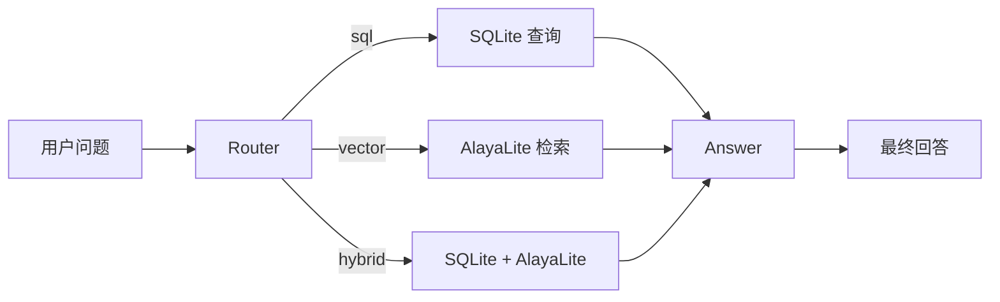

# 开场提词卡

这份文档只给讲者看。

目标：用 6-8 分钟把大家带到同一个心智模型里，然后直接进入实操。

## 你要讲清楚的三件事

1. 今天做的是一个最小 workflow，不是万能 Agent
2. `SQLite` 和 `AlayaLite` 解决的是两类不同问题
3. `LangChain` 负责组件，`LangGraph` 负责流程

## 6-8 分钟节奏

### 第 1 分钟：先说今天做什么

建议原话：

> 今天我们不讲大而全，只做一个最小 workflow。它会先判断问题该查表还是查文本，再去 SQLite 或 AlayaLite 取数据，最后让 LLM 生成答案。

此时不要展开 API 细节。

### 第 2-3 分钟：解释为什么要两种数据库

直接写这张表：

| 数据类型 | 例子 | 放哪里 |
| --- | --- | --- |
| 结构化数据 | 时间、地点、DDL | SQLite |
| 非结构化文本 | FAQ、安装说明 | AlayaLite |

建议原话：

> 能精确查表的，优先查表。向量检索不是所有问题的默认答案。

### 第 4-5 分钟：解释 LangChain 和 LangGraph

建议原话：

> LangChain 像积木，负责模型、prompt、embeddings、SQL chain。  
> LangGraph 像流程图，负责节点、状态和条件分支。

再补一句：

> 今天最值得看懂的是 route 这一步。

### 第 6-7 分钟：直接给结构图

你只需要强调两点：

- `Router` 只负责选路，不负责回答
- `Answer` 节点才负责把结果整理成自然语言

### 第 8 分钟：说明今天故意简化了什么

直接说：

1. SQLite 数据量很小
2. AlayaLite 每次启动时现建索引
3. 只做单轮问答

## 不建议展开的内容

- embedding 数学细节
- SQL 优化
- ReAct、tool calling 全家桶

## 进入实操前的过渡句

> 接下来直接跑项目：先把环境建起来，再导出 workflow 图，再跑三个问题，最后只看三处关键代码。

