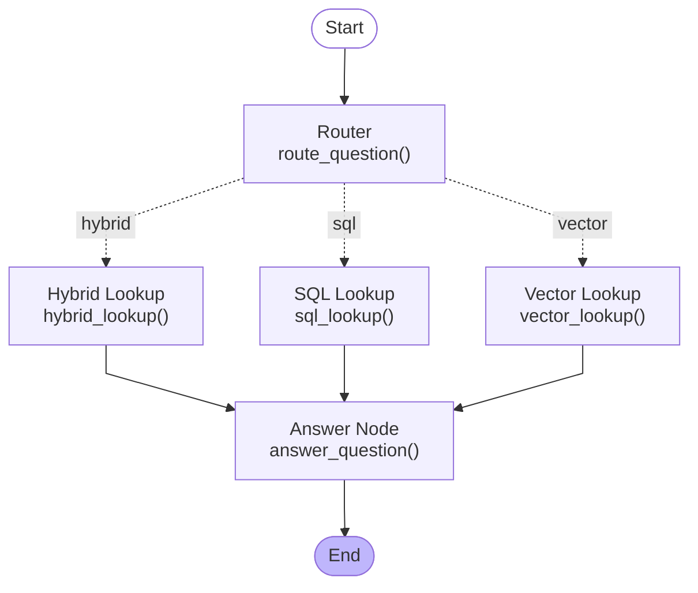

# Workflow Graph

```mermaid
---
config:
  flowchart:
    curve: linear
---
graph TD;
	__start__(["Start"]):::first
	router["Router<br/>route_question()"]
	sql_lookup["SQL Lookup<br/>sql_lookup()"]
	vector_lookup["Vector Lookup<br/>vector_lookup()"]
	hybrid_lookup["Hybrid Lookup<br/>hybrid_lookup()"]
	answer["Answer Node<br/>answer_question()"]
	__end__(["End"]):::last
	__start__ --> router;
	hybrid_lookup --> answer;
	router -. &nbsp;hybrid&nbsp; .-> hybrid_lookup;
	router -. &nbsp;sql&nbsp; .-> sql_lookup;
	router -. &nbsp;vector&nbsp; .-> vector_lookup;
	sql_lookup --> answer;
	vector_lookup --> answer;
	answer --> __end__;
	classDef default fill:#f2f0ff,line-height:1.2
	classDef first fill-opacity:0
	classDef last fill:#bfb6fc

```
